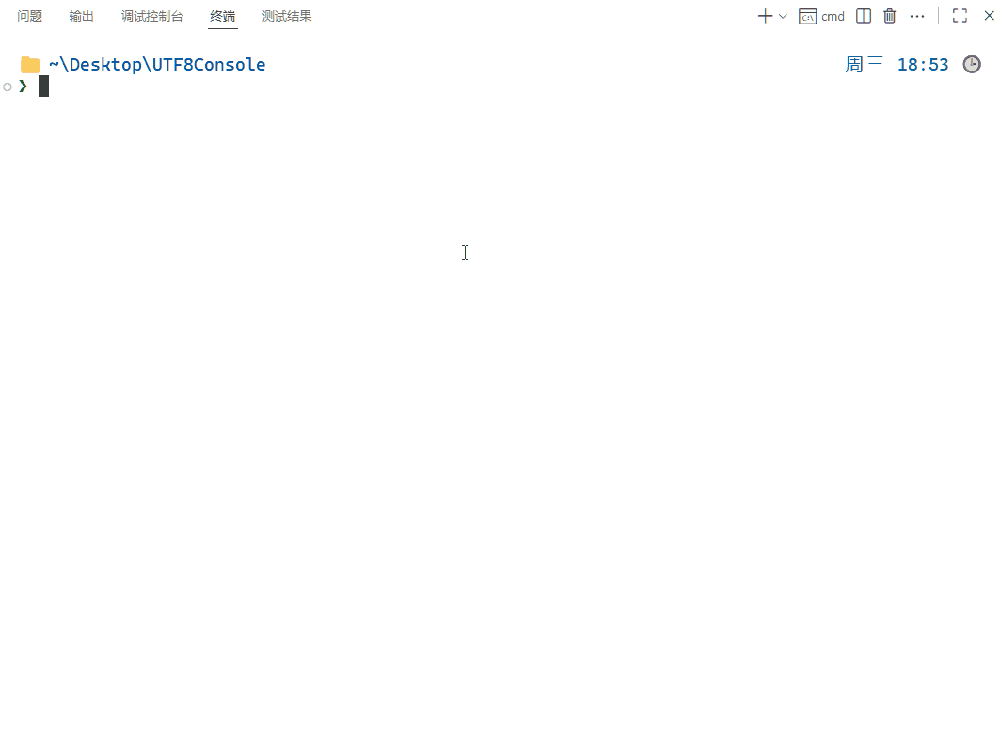
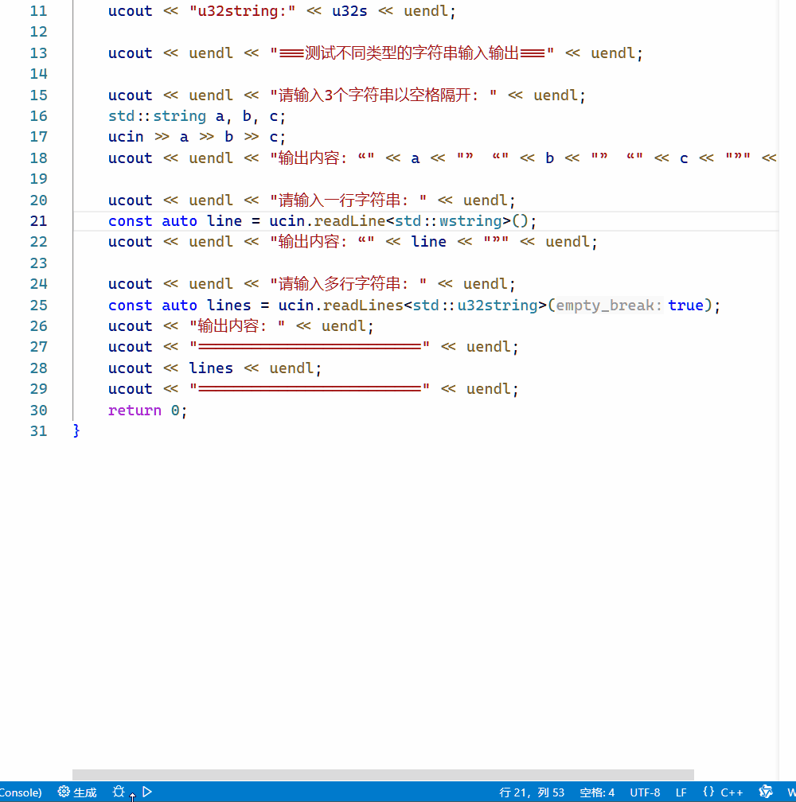

# 🖥️ UTF8Console 

<div align="center">

## 🤖 由 AI 生成 🤖
**✨ This Documentation is AI-Generated ✨**

</div>

---

[](https://en.cppreference.com/w/cpp/17)
[](https://www.microsoft.com/windows)
[](LICENSE)

## 📖 项目简介

UTF8Console 是一个专为 Windows 平台编写的 C++ 头文件，用于解决控制台应用程序中 UTF-8 编码文本的正确输入和输出问题。使开发者能够在 Windows 控制台环境中正确显示和处理中文、日文、韩文、表情符号等 Unicode 字符。

### 🎯 解决的问题

- Windows 控制台默认不使用 UTF-8 编码导致的中文乱码问题
- 不同字符串类型（std::string, std::wstring, std::u32string）之间的编码转换
- 跨编译器（MSVC 和 MinGW）兼容的 UTF-8 输入输出方案
- 控制台输入输出中对表情符号等特殊 Unicode 字符的支持

## 🏗️ 项目结构

```
.
├── CMakeLists.txt          # 主构建文件
├── utf8stream.h            # 核心头文件（包含所有功能实现）
├── test.cpp                # 测试程序
├── input.txt               # 测试输入文件
├── tests/                  # 测试目录
│   ├── CMakeLists.txt      # 测试构建文件
│   ├── simple_test.cpp     # 简单功能测试
│   ├── utf8_console_tests.cpp  # 核心功能测试
│   ├── comprehensive_test.cpp  # 全面功能测试
│   ├── input_test.cpp      # 输入功能测试
│   └── test_input.txt      # 测试输入数据
├── .vscode/                # VS Code 配置文件
│   ├── launch.json         # 调试配置
│   └── settings.json       # 编辑器设置
├── .gitignore              # Git 忽略文件配置
└── build/                  # 构建输出目录
```

## 🚀 快速开始

### 🔧 环境要求

- **操作系统**: Windows 7 及以上版本
- **编译器**: 
  - MSVC (Visual Studio 2019 及以上版本)
  - MinGW-w64 (GCC 10 及以上版本)
- **构建工具**: CMake 3.20 及以上版本
- **构建系统**: Ninja（推荐）或其他 CMake 支持的生成器
- **C++ 标准**: C++17

### 📦 构建项目

```bash
# 克隆或下载项目
git clone https://github.com/mwmi/WinUTF8Console
cd WinUTF8Console

# 创建构建目录
mkdir build
cd build

# 配置项目（使用 Ninja 作为构建系统）
cmake .. -G Ninja

# 构建项目
cmake --build .

# 或者使用其他构建系统（如 Visual Studio）
# cmake .. -G "Visual Studio 16 2019"
```

### ▶️ 运行测试程序

```bash
# 运行测试程序
UTF8Console.exe

# 使用 input.txt 作为输入
UTF8Console.exe < ../input.txt
```

### 🧪 运行测试

```bash
# 运行所有测试
ctest

# 或者运行单个测试程序
simple_test.exe
utf8_console_tests.exe
comprehensive_test.exe
input_test.exe
```

## 📚 核心功能

### ✨ 输出功能

UTF8Console 提供了 `ucout` 对象，类似于标准的 `std::cout`，但支持多种字符串类型：

```cpp
#include "utf8stream.h"

int main() {
    // 输出不同类型的字符串
    ucout << "std::string: " << std::string("Hello 世界") << uendl;
    ucout << "std::wstring: " << std::wstring(L"Hello 世界 😁") << uendl;
    ucout << "std::u32string: " << std::u32string(U"Hello 世界 😀") << uendl;
    
    // 输出基本数据类型
    ucout << "整数: " << 123 << uendl;
    ucout << "浮点数: " << 3.14159 << uendl;
    ucout << "布尔值: " << true << uendl;
    
    return 0;
}
```

### 📥 输入功能

UTF8Console 提供了 `ucin` 对象，支持多种输入方式：

```cpp
#include "utf8stream.h"

int main() {
    // 读取单词
    std::string word1, word2, word3;
    ucin >> word1 >> word2 >> word3;
    
    // 读取一行
    std::string line = ucin.readLine<std::string>();
    
    // 读取多行
    std::vector<std::string> lines = ucin.readLines<std::string>();
    
    return 0;
}
```

### 🔁 字符串转换

头文件中提供了多种字符串编码转换函数：

```cpp
#include "utf8stream.h"

// 宽字符串与 UTF-8 字符串转换
std::string utf8_str = wstring_to_utf8(L"Hello 世界");
std::wstring wstr = utf8_to_wstring("Hello 世界");

// UTF-32 字符串与 UTF-8 字符串转换
std::string utf8_from_u32 = u32string_to_utf8(U"Hello 世界");
std::u32string u32str = utf8_to_u32string("Hello 世界");

// UTF-32 字符串与宽字符串转换
std::wstring wstr_from_u32 = u32string_to_wstring(U"Hello 世界");
```

## 🛠️ 高级特性

### 🧱 自动编码设置

UTF8Console 会自动设置控制台的输入输出编码为 `UTF-8`，无需手动执行 `chcp 65001` 命令。

### 🔧 静态链接

在非调试模式下，项目会自动进行静态链接，生成的可执行文件不依赖外部运行时头文件，提高了可移植性。

### 🌐 跨编译器支持

- **MSVC**: 自动启用 `/utf-8` 编译选项
- **MinGW**: 自动添加 `-static` 链接标志

## 📖 使用示例

### 基本输出示例

```cpp
#include "utf8stream.h"

int main() {
    ucout << "===测试不同类型的字符串输出显示===" << uendl << uendl;

    auto s = "😁😀😂 123 一二三 abc";
    auto ws = L"😁😀😂 123 一二三 abc";
    auto u32s = U"😁😀😂 123 一二三 abc";
    ucout << "string:   " << s << uendl;
    ucout << "wstring:  " << ws << uendl;
    ucout << "u32string:" << u32s << uendl;

    return 0;
}
```

### 输入输出示例

```cpp
#include "utf8stream.h"

int main() {
    ucout << uendl << "===测试不同类型的字符串输入输出===" << uendl;

    ucout << uendl << "请输入3个字符串以空格隔开: " << uendl;
    std::string a, b, c;
    ucin >> a >> b >> c;
    ucout << uendl << "输出内容: “" << a << "”  “" << b << "”  “" << c << "”" << uendl;

    ucout << uendl << "请输入一行字符串: " << uendl;
    const auto line = ucin.readLine<std::wstring>();
    ucout << uendl << "输出内容: “" << line << "”" << uendl;

    ucout << uendl << "请输入多行字符串: " << uendl;
    const auto lines = ucin.readLines<std::u32string>(true);
    ucout << "输出内容: " << uendl;
    ucout << "=========================" << uendl;
    ucout << lines << uendl;
    ucout << "=========================" << uendl;
    
    return 0;
}
```

## 🖼️ 示例图片

以下是在 Windows 控制台中运行 UTF8Console 的效果展示：

### 基本输入输出流


### 文件流输入测试


### 调试控制台测试


## 🧪 测试说明

项目包含多种测试用例，确保功能的正确性和稳定性：

1. **simple_test.cpp**: 基本功能测试
2. **utf8_console_tests.cpp**: 核心功能测试
3. **comprehensive_test.cpp**: 全面功能测试
4. **input_test.cpp**: 输入功能测试

## ⚙️ 构建配置

### CMake 配置说明

- **C++17 标准**: 项目要求使用 C++17 标准
- **MSVC UTF-8 支持**: 自动为 MSVC 编译器添加 `/utf-8` 标志
- **静态链接**: 在非调试模式下自动启用静态链接

### 编译器特定设置

```cmake
# MSVC UTF-8 支持
if(MSVC)
    set(CMAKE_CXX_FLAGS "${CMAKE_CXX_FLAGS} /utf-8")
    set(CMAKE_C_FLAGS "${CMAKE_C_FLAGS} /utf-8")
endif()

# 静态链接设置
if(NOT CMAKE_BUILD_TYPE STREQUAL "Debug")
    if (MINGW)
        set(CMAKE_EXE_LINKER_FLAGS "${CMAKE_EXE_LINKER_FLAGS} -s -static")
    elseif (MSVC)
        set(CMAKE_MSVC_RUNTIME_LIBRARY "MultiThreaded$<$<CONFIG:Debug>:Debug>")
    endif()
endif()
```

## 📋 注意事项

1. **平台限制**: 该项目仅支持 Windows 平台
2. **控制台字体**: 建议使用支持中文的字体（如 Consolas、Microsoft YaHei 等）
3. **编码设置**: 程序会自动设置控制台编码为 UTF-8
4. **静态链接**: 为提高可移植性，建议使用静态链接构建

## 📄 许可证

本项目采用 MIT 许可证，详见 [LICENSE](LICENSE) 文件。

## 🤝 贡献

欢迎提交 Issue 和 Pull Request 来改进这个项目！

## 📞 联系方式

如有任何问题或建议，请通过以下方式联系：

- 提交 GitHub Issue
- 发送邮件至项目维护者邮箱

---

🎉 感谢您使用 UTF8Console！希望它能帮助您在 Windows 控制台中更好地处理 UTF-8 编码文本！